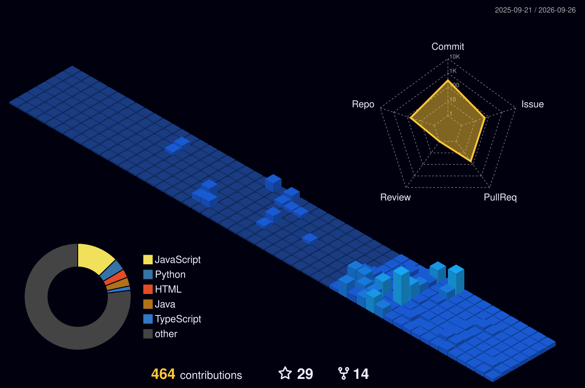

<table width="100%">
<tr>
<td width="42%" align="center" valign="middle">

</td>
<td valign="middle">
<pre>
╔══════════════════════════════════════════════════════╗
║                                                      ║
║  ██████╗ ██╗██╗   ██╗███████╗██╗  ██╗              ║
║  ██╔══██╗██║██║   ██║██╔════╝██║  ██║              ║
║  ██████╔╝██║██║   ██║███████╗███████║  BUILD.       ║
║  ██╔═══╝ ██║██║   ██║╚════██║██╔══██║  SHIP.        ║
║  ██║     ██║╚██████╔╝███████║██║  ██║  REPEAT.      ║
║  ╚═╝     ╚═╝ ╚═════╝ ╚══════╝╚═╝  ╚═╝              ║
║                                                      ║
║  B.Tech CSE · WCE Sangli · 9.0 GPA                  ║
║  AI Intern · OSS Contributor · Ships Real Things     ║
╚══════════════════════════════════════════════════════╝
</pre>
</td>
</tr>
</table>

<div align="center">

[](https://www.linkedin.com/in/piush-gogi-90a44737b/)
[](https://x.com/PiushGogi007)
[](https://leetcode.com/u/piushgogi/)
[](https://www.hackerrank.com/profile/piushgogi)
[](mailto:piushgogi@gmail.com)

</div>

---

## ⚡ CURRENTLY EXECUTING

```bash
piush@fedora:~$ ./status --verbose

  [ACTIVE]   AI Intern @ Capabl
             └─ DevFlow Agent — multi-agent LLM orchestration system
                ├─ 4 specialized agents · task routing · context memory
                └─ Groq → Gemini → OpenRouter fallback chain · Flask

  [LIVE]     Diploma Dost — Open-Source PWA
             └─ React · Vite · Supabase
                ├─ 7 contributors · 90+ production deployments
                └─ built for diploma engineering students across India

  [WIP]      Marathi Political Sentiment Analysis
             └─ 2,398 YouTube comments · LLM labeling pipeline
                └─ targeting arXiv

  [LOCKED]   GSoC 2027 — Mesa / PSF  (ML/RL/AI Integration track)

  [SYSTEM]   Fedora Linux 44 · KDE Plasma 6 · Catppuccin Mocha · Dell G15
             └─ yes, this matters

piush@fedora:~$ █
```

---

## 🚀 SHIPS

| | PROJECT | IMPACT | STACK | STATUS |
|:---:|:---|:---|:---|:---:|
| 🤖 | **[DevAgent-Flow](https://github.com/piush365/DevAgent-Flow)** | Multi-agent LLM orchestrator — 4 specialized agents, provider fallback chain | `Python` `Flask` `LangGraph` `Groq` `Gemini` `OpenRouter` |  |
| 📚 | **[Diploma Dost](https://github.com/piush365/Diploma-Dost)** | Open-source PWA — 7 contributors, 90+ production deployments | `React` `Vite` `Supabase` `PWA` |  |
| ⚡ | **[Flash Sale System](https://github.com/piush365/flashstrike)** | 10,000+ concurrent requests — zero meltdowns | `Java` `Spring Boot` `Kafka` `Redis` `Docker` |  |
| 🧠 | **[Marathi Sentiment](https://github.com/piush365/marathi-political-sentiment)** | LLM-labeled 2,398 YouTube comments for political NLP research | `Python` `NLP` `LLM` `Pandas` |  |

---

## 🔀 OPEN SOURCE FOOTPRINT

```
╔─────────────────────────────────────────────────────────────────────────╗
│  MERGED PULL REQUESTS                                                   │
╠═════════════════════════════════════════════════════════════════════════╣
│  ✓  mcp-docs-assistant    ··  SSR hydration fix                        │
│  ✓  python-docspec        ··  .pyi stub support for type checking      │
╠═════════════════════════════════════════════════════════════════════════╣
│  MAINTAINING                                                            │
╠═════════════════════════════════════════════════════════════════════════╣
│  ⬡  Diploma Dost          ··  core maintainer · 7 contributors         │
╚─────────────────────────────────────────────────────────────────────────╝
```

---

## 🛠 ARSENAL

**[ LANGUAGES ]**


**[ BACKEND ]**


**[ AI / ML ]**


**[ FRONTEND ]**


**[ DATABASE ]**


**[ DEVOPS / INFRA ]**


---

## 📌 PINNED

<div align="center">

| | |
|:---:|:---:|
| [](https://github.com/piush365/Diploma-Dost) | [](https://github.com/piush365/marathi-political-sentiment) |
| [](https://github.com/piush365/flashstrike) | [](https://github.com/piush365/DevAgent-Flow) |


</div>

---

## 📊 ANALYTICS

<div align="center">


</div>

---

<div align="center">

[](https://github.com/piush365)

</div>

---

<div align="center">



</div>

---

<div align="center">
<pre>
  [ ships or it didn't happen · 9.0 GPA · 151 leetcode · fedora btw ]
</pre>
</div>
